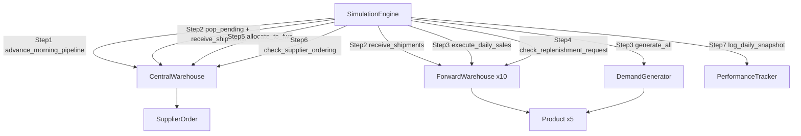
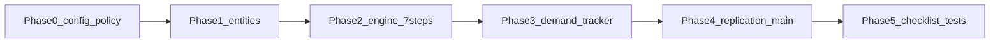

# CW-FW 即时零售仿真器实现计划

## 目标与约束

- **规范来源**：[cw_fw_ss_simulation_model.pdf](/Users/oliverhuang/Desktop/me/cw_fw_ss_simulation_model.pdf)（Section 4 七日序、Algorithm 1–3、Section 12–16）
- **工作区**：[`2026_furp_零售/`](/Users/oliverhuang/Desktop/2026_furp_零售)（当前为空，从零搭建）
- **语言**：Python 3.10+
- **架构原则**：7 个业务类 + `SimulationConfig`；`SimulationEngine.run()` 显式编排 Step 1–7，业务逻辑不藏在隐式 daily tick 里
- **(s,S)**：用 Section 10/11 公式从 \(\lambda_{i,k}=\rho_i\bar\lambda_k\) 计算，单元测试 assert 与 Table 4/5 一致

## 类职责与数据流



| 类 | 文件 | 核心职责 |
|----|------|----------|
| `SimulationConfig` | `config/settings.py` | \(T_{warm}=30, T=365, R=30, CC=3600, CF=180, \epsilon=10^{-6}\), seeds |
| `Product` | `models/product.py` | 5 实例：\(\bar\lambda_k, p_k, h^C_k, h^F_k, b_k\) |
| `SupplierOrder` | `models/supplier_order.py` | `quantities: np.ndarray[5]`, `remaining_lead_time: int` |
| `ForwardWarehouse` | `models/forward_warehouse.py` | `IF`, \(\rho_i\), \(s^F/S^F\), 当日 \(D/Y/LS/RF\) |
| `CentralWarehouse` | `models/central_warehouse.py` | `IC`, pipeline, `pending_fw_shipments`, \(s^C/S^C\) |
| `DemandGenerator` | `models/demand_generator.py` | Poisson 需求，seed 可控 |
| `SimulationEngine` | `simulation/engine.py` | 显式 Step 1–7 + replication 循环 |
| `PerformanceTracker` | `metrics/performance_tracker.py` | phase 快照、日 profit、最终 KPI + 95% CI |

## 目录结构

```
2026_furp_零售/
├── config/
│   ├── settings.py          # SimulationConfig dataclass
│   └── defaults.py          # PDF Table 2–3 默认参数 + rho 列表
├── models/
│   ├── product.py
│   ├── supplier_order.py
│   ├── forward_warehouse.py
│   ├── central_warehouse.py
│   ├── demand_generator.py
│   └── policy.py            # sF/SF/sC/SC 公式（Section 10/11）
├── simulation/
│   ├── engine.py
│   └── day_record.py        # 单日快照 dataclass（供 Tracker 入参）
├── metrics/
│   └── performance_tracker.py
├── tests/
│   ├── test_policy.py       # assert Table 4/5
│   ├── test_pipeline.py     # Algorithm 1
│   ├── test_allocation.py   # Algorithm 2
│   ├── test_one_day.py      # 固定需求手工 trace
│   └── test_checklist.py    # PDF C1–C10
├── main.py                  # R 次 replication + 输出
├── requirements.txt         # numpy, pytest
└── README.md                # 运行说明（简要）
```

## Phase 0：配置与策略公式（地基）

**实现 `config/` + `models/policy.py`**

- `defaults.py`：Table 2 五产品经济参数；Table 3 的 \(\rho_i\)
- `policy.py`：
  - FW：\(s^F_{i,k}=\lceil\lambda_{i,k}+1.28\sqrt{\lambda_{i,k}}\rceil\)，\(S^F_{i,k}=\lceil 3\lambda_{i,k}+1.64\sqrt{3\lambda_{i,k}}\rceil\)
  - CW：\(\Lambda_k=11\bar\lambda_k\)，\(s^C_k=\lceil 3\Lambda_k+1.64\sqrt{3\Lambda_k}\rceil\)，\(S^C_k=\lceil 7\Lambda_k+1.64\sqrt{7\Lambda_k}\rceil\)
- `test_policy.py`：逐格 assert 与 Table 4/5 一致；assert \(\sum_k S^F_i \le 180\)、\(\sum_k S^C_k < 3600\)

## Phase 1：核心实体类（无随机）

### `SupplierOrder`
- 纯 `@dataclass`，新建时 `remaining_lead_time >= 1`

### `ForwardWarehouse`
- 构造：注入 `fw_id`, `rho`, `products`, `CF`, 由 `policy.py` 算 \(s^F/S^F\)
- `receive_shipments(qty: ndarray[5])` → 更新 `IF`
- `execute_daily_sales(demand)` → \(Y=\min(IF,D)\), \(LS=D-Y\), 更新 `IF`；存 `today_demand/sales/lost_sales`
- `check_replenishment_request()` → Section 10：若 \(IF \le s^F\) 则 \(RF=S^F-IF\) 否则 0；存 `today_requests`
- `get_inventory_copy()` → 返回副本防外部篡改

### `CentralWarehouse`
- 初始：`IC = SC`，`supplier_pipeline = []`，`pending_fw_shipments = {fw_id: zeros(5)}`
- `advance_morning_pipeline()` → **Algorithm 1**：每条 order `ro -= 1`；`ro==0` 则 `IC += qo` 并移除
- `pop_pending_shipments(fw_id)` → 取出并清零该 FW 的待发运量
- `allocate_to_fws(requests, fws, post_demand_inv)` → **Algorithm 2**（按产品 k 循环）：
  - 充足：\(X_{i,k}=RF_{i,k}\)
  - 不足：floor 比例分配 + DOS 余量分配（\(\epsilon=10^{-6}\)）
  - 扣减 `IC`；写入 `pending_fw_shipments`；返回 `shipments` 与 `shortage_flags`（\(A_k\)）
- `check_supplier_ordering(rng)` → 算 \(IP^C_k=\tilde{IC}_k+\sum_o q^C_{k,o}\)；若 \(IP^C_k \le s^C_k\) 则 \(Q^C_k=S^C_k-IP^C_k\)；若 \(\sum_k Q^C_k>0\) 追加**一条** `SupplierOrder(QC_vector, LC~U{1,2,3})`

## Phase 2：显式 7 步 Engine

**`simulation/engine.py` 核心循环**（与 PDF Section 4 一一对应）：

```python
for day in range(1, T_warm + T + 1):
    cw.advance_morning_pipeline()
    ic_begin = cw.get_inventory_copy()

    for fw in fws:
        fw.receive_shipments(cw.pop_pending_shipments(fw.id))
    if_begin = {fw.id: fw.get_inventory_copy() for fw in fws}

    demands = demand_gen.generate_all(fws, products)
    for fw in fws:
        fw.execute_daily_sales(demands[fw.id])
    if_end = {fw.id: fw.get_inventory_copy() for fw in fws}

    requests = {fw.id: fw.check_replenishment_request() for fw in fws}
    shipments, shortage = cw.allocate_to_fws(requests, fws, if_end)
    ic_end = cw.get_inventory_copy()

    cw.check_supplier_ordering(rng)

    tracker.log_daily_snapshot(day, ic_begin, ic_end, if_begin, if_end,
                               demands, requests, shipments, shortage,
                               is_warmup=(day <= T_warm))
```

**初始条件**（Section 15）：`IF_{i,k,1}=S^F_{i,k}`，`IC_{k,1}=S^C_k`，pipeline 空，pending 全 0

**`test_one_day.py`**：1 FW + 固定 demand，手算验证库存轨迹与 \(RF/X\)

## Phase 3：随机需求 + 绩效追踪

### `DemandGenerator`
- `lambda_ik = rho_i * product.lambda_bar`
- `generate_all(fws, products)` → `dict[fw_id, ndarray[5]]`，`np.random.poisson`
- 接受 `seed`，满足 C10

### `PerformanceTracker`
- **Phase 快照**（Section 12）：
  - \(\bar{IF}_{i,k}=(IF^b+IF^e)/2\)，\(\bar{IC}_k=(IC^b+IC^e)/2\)
  - 日 profit：\(\Pi_t = Rev - Hold - Pen\)
- **仅统计 `day > T_warm`**（Section 13）：
  - FillRate, LostSalesRate
  - AvgFWInv, AvgCWInv
  - FW/CW capacity utilization（mean, max, p95）
  - CWShortFreq\_k
- `summarize()` 返回 replication 级 dict；`report_final_metrics(replications)` 算 mean ± \(1.96\,s/\sqrt{R}\)

## Phase 4：Replication 与入口

**`main.py`**
- 循环 `R=30` replications，`seed = base_seed + r`
- 打印 baseline summary（对齐 PDF Table 6）
- 可选：保存每次 replication 的 seed 与指标 CSV

## Phase 5：验证与回归（Section 16 Checklist）

| Check | 测试位置 |
|-------|----------|
| C1 非负 | `test_checklist.py` property test |
| C2 销售可行 | assert \(Y \le D\) 且 \(Y \le IF_{before}\) |
| C3/C4 发运可行 | \(0 \le X \le RF\)，\(\sum_i X_{i,k} \le IC_k\) |
| C5/C6 容量 | Step 2 后 FW、Step 1 后 CW |
| C7 Pipeline | 新建 `ro>=1`；到货恰好一次 |
| C8/C9 无 carry-over | lost sales / 未满足 RF 不结转 |
| C10 Seed | 同 seed 结果可复现 |

额外：**golden snapshot**（固定 seed，保存 Day 1–5 JSON）防回归。

## 实现顺序（建议）



1. `config/` + `policy.py` + `test_policy.py`
2. `SupplierOrder`, `ForwardWarehouse`, `CentralWarehouse` + `test_pipeline.py`, `test_allocation.py`
3. `SimulationEngine` + `test_one_day.py`
4. `DemandGenerator`, `PerformanceTracker`
5. `main.py` + `test_checklist.py`

## 里程碑验收

- **M1**：`test_policy` + `test_allocation` 全绿（核心算法正确）
- **M2**：10 FW × 5 Product，固定 seed 跑 395 天无异常，日 profit 曲线合理
- **M3**：R=30 baseline 输出 FillRate / Profit / CWShortFreq 及 95% CI
- **M4**：C1–C10 checklist 全通过

## 刻意不做（本阶段范围外）

- PDF Section 17 敏感性实验（baseline 验证后再加 `experiments/`）
- PDF Section 18 disruption 扩展
- RL / 优化策略替换

## 关键设计决策（已确认）

- **语言**：Python 3.10+
- **(s,S)**：公式计算 + 单元测试对齐 Table 4/5
- **Step 1/2 拆分**：`advance_morning_pipeline` 仅做供应商到货；FW 到货由 Engine Step 2 显式触发
- **供应商订单**：整单 5 品项共用一个 lead time
